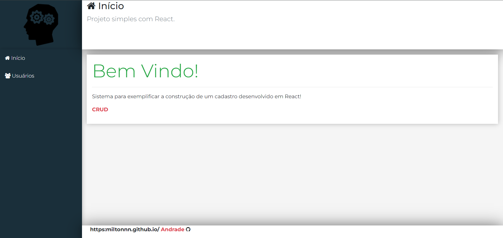
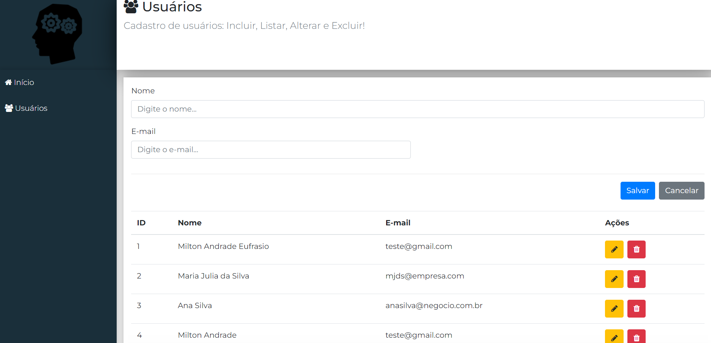
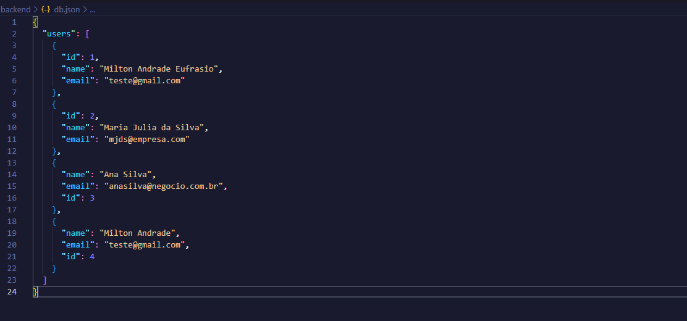

#   CRUD com React
Este projeto consiste em um CRUD básico de usuários utilizando React. 
Ele permite realizar as operações de inclusão, listagem, alteração e exclusão de usuários.

## Tela inicial

## Tela dos usuários cadastrados

## db.json

## Tecnologias Utilizadas
* React
* React Router DOM
* Axios
* Bootstrap
* Font Awesome
  
## Como Inicializar
* Certifique-se de ter o Node.js instalado em sua máquina.
* Clone este repositório.
* Navegue até o diretório do projeto.
* Instale as dependências com o comando `npm install.`
* Inicie o servidor com o comando `npm start.`
* O projeto estará disponível no navegador no endereço `http://localhost:3000.`

## Estrutura do Projeto
* `index.js:` Arquivo principal que inicializa o aplicativo React.
* `App.js:` Componente principal que define a estrutura geral da aplicação, incluindo rotas e layout.
* `UserCrud.js:` Componente responsável pela lógica do CRUD de usuários, incluindo formulário de cadastro, listagem, edição e exclusão de usuários.
* `main.js:` Componente que define o layout principal da aplicação, incluindo cabeçalho e rodapé.
* `routes.js:` Arquivo que contém as definições das rotas da aplicação.

## Funcionalidades
* Inclusão de novos usuários com nome e e-mail.
* Listagem de usuários cadastrados.
* Edição dos dados de usuários existentes.
* Exclusão de usuários da base de dados.
  
Para utilizar este projeto, certifique-se de ter uma API REST funcionando corretamente para interagir com o backend.
No exemplo fornecido, é utilizado o endpoint `http://localhost:3001/users`.
Certifique-se de ajustar este endpoint conforme necessário para se adequar à sua configuração de backend.

